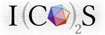

# Rule Based Modelling Ontology and Examples
Rule-based Modelling Ontology (RBMO) is an ontology for annotating rule-based models. This ontology provides terms to annotate agents and their rules. Terms also exist to annotate rate parameters and observables. Compositional features of agents, such as sites and their states can also explicitly be defined.

##Download
Version 1 of the ontology can be downloaded from the [ontology](ontology) folder. 

The ontology is available in different formats, such as Manchester Syntax, OWL and Turtle. To convert it into other formats, please use the [Protege](http://protege.stanford.edu) ontology editor and export using a desired a format.

##Examples
As complete examples, we provide a fully annotated biological models that can be executed in the current available version of the Kappa simulator KaSim and BioNetGen simulator RuleBender.

The model represents the combination of a two-component system and a promoter architecture based on dual repression. The model is basic and coarse-grained, excluding many biological details, but it is enough to provide an intuitive examples of the proposed annotation schema. The proposed annotation schema can be, however, equally used to annotated more detailed models.

[Click here](examples/tcs.kappa) to download the fully annotated Kappa model

[Click here](examples/tcs.bngl) to download the fully annotated BNGL model

[Click here](examples/tcs.ttl) to download only the RDF annotations in the Turtle format

##Selected Terms and Properties

| Name | Description |
|--------|--------|
| Rule   | Type for biochemical interactions between agents.|
| Agent  | Type for entities that represent biological entities participating in a rule.|
| Site   | Type for sites of agents.|
| State  | Type for internal states of sites.|
| Configuration | Specifies a configuration of an agent in terms of the status of its sites.|
| Model | To indicate a model type.|
| Kappa | To indicate a model type as Kappa.|
| BioNetGen | To indicate a model type as BioNetGen.|
| Compartment | Type for compartments.|
| hasSite | Specifies that an agent has a site. Its value is the identifier for the site.|
| hasState | Specifies that an site has an internal state. Its value is the identifier for the state.|
| stateAssignment | Links a state to its value, e.g. a term from an external ontology.|
| subrule | Specifies that a rule has a subrule (such as a KaSim rule that uses tokens). Its value is the identifier for the subrule. |
| hasConfiguration | Specifies that a special configuration of an agent includes additional information.|

##Contributors
 

Turing Ate My Hamster LTD

##Contact
If you are interested in the development of RBMO, please email: rbmontology@gmail.com 

